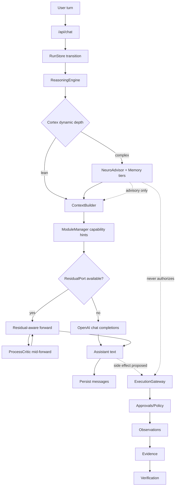
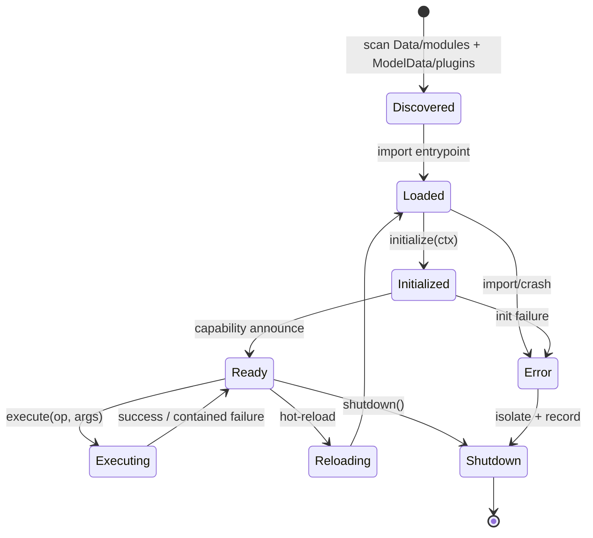

# LEVIATHAN Phase 46+ — Top-Tier Frontier Neuro Layer

> **Status:** Phase 53+ SpaceX/xAI Grok-level residual orchestration (EXTERNAL-FIRST)  
> **Baseline:** Phase 52 Grok-level depth jump + RAG V3 / Neural production path  
> **Current version marker:** `0.59.0-phase53`  
> **Authority:** This document is the design contract. Executable code and tests win when they disagree; update this doc when architecture changes.

---

## 0. Mission and non-negotiables

Elevate LEVIATHAN from a strong local control plane to a **near-frontier reasoning system** that remains:

- fully local / air-gappable;
- hardware-mapped;
- honest under failure;
- integrated with **one** database, **one** model gateway path, **one** Execution Gateway + Approvals + Evidence + Verification plane.

### Invariants (unchanged)

```text
model output        ≠ evidence
neural signal       ≠ authority   (until proven via Evidence + Verification)
discoverable        ≠ authorized
request boolean     ≠ authority
unmeasured          ≠ passed
residual injection  = explicit, optional, degradable
```

Residual injection that influences **side effects** MUST still pass Execution Gateway + Approvals + Evidence + Verification. Advisory residual influence on prompt/context is allowed only under feature flags and must be telemetered.

### Anti-patterns (forbidden)

- Second SQLite / vector DB “for neuro”
- Parallel model client bypassing `Data/modules/model_runtime/`
- Parallel approval / gateway / evidence systems
- Claiming residual injection works when the active runtime cannot expose residuals
- Silent exception swallowing that creates false success
- Per-plugin custom loaders beside Universal Module Manager

---

## 1. High-level architecture

```text
                         ┌─────────────────────────────┐
                         │   Browser / Operator UI     │
                         │   (React / Vite / TS)       │
                         └──────────────┬──────────────┘
                                        │ /api/*
                                        ▼
                         ┌─────────────────────────────┐
                         │ FastAPI composition root    │
                         │ Data/backend/main.py        │
                         └──────────────┬──────────────┘
                                        │
          ┌─────────────────────────────┼─────────────────────────────┐
          ▼                             ▼                             ▼
 ┌──────────────────┐        ┌──────────────────┐        ┌──────────────────┐
 │ ReasoningEngine  │        │ ContextBuilder   │        │ ObservabilityHub │
 │ (plan / depth)   │◄──────►│ (+ neuro hints)  │        │ (+ neuro metrics)│
 └────────┬─────────┘        └────────┬─────────┘        └──────────────────┘
          │                           │
          ▼                           ▼
 ┌──────────────────────────────────────────────────────────────────────────┐
 │                     NEURO LAYER (Data/modules/neuro/)                     │
 │  Advisor │ ProcessCritic │ CortexPlanner │ MemoryTiers │ ResidualPort   │
 └────────────┬───────────────────────────────┬─────────────────────────────┘
              │                               │
              ▼                               ▼
 ┌──────────────────────┐          ┌────────────────────────────┐
 │ Universal Module     │          │ Model Runtime              │
 │ Manager              │          │ OpenAI-compatible (default)│
 │ ILeviathanModule     │          │ + optional ResidualPort    │
 │ discover→…→shutdown  │          │ (vLLM / llama.cpp / …)     │
 └──────────┬───────────┘          └─────────────┬──────────────┘
            │                                    │
            ▼                                    ▼
 ┌──────────────────────┐          ┌────────────────────────────┐
 │ CapabilityCatalog    │          │ Residual stream (optional) │
 │ Plugin bindings      │          │ read / inject / critic     │
 └──────────┬───────────┘          └────────────────────────────┘
            │
            ▼
 ┌──────────────────────────────────────────────────────────────────────────┐
 │ ExecutionGateway → Policy/Approvals → Observations → Evidence → Verify  │
 │                         (ONLY path for side effects)                     │
 └──────────────────────────────────────────────────────────────────────────┘
            │
            ▼
 ┌──────────────────────────────────────────────────────────────────────────┐
 │ Central SQLite (migrations) + Knowledge V2 (D:/ModelData) + MemoryStore │
 └──────────────────────────────────────────────────────────────────────────┘
```

### Mermaid — request lifecycle with Neuro



### Mermaid — Universal Module Manager lifecycle



---

## 2. Ownership map (where things live)

| Concern | Owner | Notes |
|---|---|---|
| Universal Module Manager | `Data/modules/module_manager/` | Single loader for plugins + neuro modules |
| Neuro advisory / critic / cortex / residual contracts | `Data/modules/neuro/` | Extends Phase 21; remains advisory for authority |
| Controlled memory (Tier 1 durable) | `Data/modules/memory/` | Extend kinds; **no new DB** |
| Semantic knowledge (Tier 2) | `Data/modules/knowledge/` | Knowledge V2 + `D:/ModelData` ingest |
| Model I/O | `Data/modules/model_runtime/` | ResidualPort optional adapter |
| Context packing | `Data/modules/context/` | May consume neuro sections |
| Side effects | `Data/modules/execution/` + approvals/evidence/verification | Unchanged authority plane |
| Feature flags | `Data/backend/config.py` | Parent/child validation |
| Telemetry | `Data/modules/observability/` | Neuro category events |
| Training registry | `Data/modules/training/` | Recipes register here; no fake metrics |
| Schema | `Data/backend/migrations.py` | Central DB only |

---

## 3. Universal Module Manager (highest priority)

### 3.1 Why

Phase 22 PluginRegistry is **declarative catalog binding**, not a loader. Function Runtime loads **functions**, not long-lived domain modules. Without one manager, every plugin invents its own lifecycle → drift, duplicate capability wiring, crash bleed-through.

### 3.2 Strict interface — `ILeviathanModule`

```python
class ILeviathanModule(Protocol):
    @property
    def manifest(self) -> ModuleManifest: ...

    def initialize(self, ctx: ModuleContext) -> None: ...
    def execute(self, operation: str, arguments: Mapping[str, Any]) -> ModuleResult: ...
    def shutdown(self) -> None: ...
    def health(self) -> ModuleHealth: ...
    # Optional:
    def reload(self) -> None: ...
    def capabilities(self) -> Sequence[CapabilityAnnouncement]: ...
```

### 3.3 Manifest contract

```text
module_id:        stable string (e. andg. "mcp.echo", "neuro.cortex")
name, version:    human + semver
entrypoint:       import path "pkg.mod:Factory" returning ILeviathanModule
capabilities:     list of capability ids OR announcement stubs
permissions:      required permission tokens
side_effects:     READ|WRITE|NETWORK|EXECUTE|...
isolation:        INPROC | SUBPROCESS (MVP: INPROC + crash containment)
hot_reload:       bool
neuro_hooks:      optional {residual, memory, critic}
source_path:      discovered path
```

Discovery roots (ordered):

1. `Data/modules/*/module.json` (first-party)
2. `{LEVIATHAN_DATA_ROOT}/plugins/*/module.json` (default `D:/ModelData/plugins/`)

No per-plugin wrapper classes in the manager. Plugins implement the interface (or a tiny factory). Existing PluginRegistry becomes a **binding helper** used during `initialize`, not a second loader.

### 3.4 Lifecycle semantics

| Phase | Behavior | Failure mode |
|---|---|---|
| discover | Parse manifests; do not import yet | Skip invalid JSON; emit telemetry |
| load | Import entrypoint factory | Module → ERROR; others continue |
| initialize | Wire catalog/bindings; no side effects | ERROR; isolate |
| execute | Run operation with timeout | Contained ModuleResult FAILED |
| shutdown | Close resources | Best-effort; log |
| hot-reload | shutdown → load → initialize | Keep previous Ready if reload fails |

**Crash containment (MVP):** try/except + timeout around execute; module marked ERROR; manager remains alive.  
**Later:** optional SUBPROCESS isolation for untrusted ModelData plugins.

### 3.5 Capability routing

```text
Module.capabilities()
    → CapabilityAnnouncement
    → CapabilityCatalog.register (if missing)
    → PluginCapabilityBinding (if external name)
    → ExecutionGateway (ONLY execution path)
```

`discoverable ≠ authorized` remains absolute.

### 3.6 Relationship to Function Runtime

| | Function Runtime | Module Manager |
|---|---|---|
| Unit | cold helper in `Data/functions/` | domain/plugin module |
| Lifecycle | ON_DEMAND unload | long-lived Ready |
| Side effects | via gateway when catalogued | via gateway when catalogued |
| Overlap | none if ownership respected | Module may *call* functions |

---

## 4. Residual-Stream Neuro Core

### 4.1 Port, not provider lock-in

Default model path today is OpenAI-compatible chat completions (**no residual access**). Residual features must degrade honestly.

```python
class ResidualStreamPort(Protocol):
    def supports_residuals(self) -> bool: ...
    def list_hook_points(self) -> Sequence[ResidualHookPoint]: ...
    def read(self, request: ResidualReadRequest) -> ResidualTensorRef: ...
    def inject(self, request: ResidualInjectRequest) -> ResidualInjectReceipt: ...
    def run_forward(self, request: ResidualForwardRequest) -> ResidualForwardResult: ...
```

Adapters (future):

| Runtime | Adapter | Residual fidelity |
|---|---|---|
| LM Studio / generic OpenAI | `UnsupportedResidualRuntime` | none — honest |
| vLLM with hooks plugin | `VllmResidualAdapter` | layer read/inject |
| llama.cpp custom server | `LlamaCppResidualAdapter` | selected layers |
| TensorRT-LLM | `TrtResidualAdapter` | engine-dependent |
| Local HF/transformers in-proc | `HFTransformersResidualAdapter` | full (dev) |

### 4.2 Injection modes

| Mode | Meaning | Gate |
|---|---|---|
| `ADDITIVE` | `h' = h + α·Δ` | flag + telemetry |
| `GATED` | `h' = h + σ(g)·Δ` | flag + telemetry |
| `REPLACE_SLICE` | overwrite subspace | flag + stronger audit |
| `DISABLED` | no-op receipt | default |

Any injection that changes **tool/capability proposals** still cannot authorize execution.

### 4.3 Reasoning cortex (middle-layer functional circuits)

Not a second model. Optional functional blocks engaged by **dynamic depth**:

```text
lean path:     embedding/context → base forward → answer
complex path:  + Tier0/1/2 memory retrieve
               + cortex blocks (N extra functional layers OR replay mid-layers)
               + process critic loop (bounded K)
               + optional ModuleManager search ops
```

CortexPlanner inputs: ReasoningPlan.complexity, neuro flags, token budget, residual availability.  
Output: `CortexEngagement` (advisory plan for forward path) — **not** completion truth.

### 4.4 Process-critic head

Scores intermediate states on:

1. consistency (self-contradiction risk);
2. goal progress (plan step coverage);
3. factual grounding (overlap with Knowledge/Evidence ids — **citations**, not vibes).

When residuals unavailable: Phase 21-style heuristic critic remains (honest provenance `method=keyword_risk` or `method=lexical_grounding`).

Critic output = `NeuroSignal(kind=process_critic)` — advisory.

---

## 5. Multi-Tier Neuro Memory

| Tier | Name | Store owner | Residual inject | Snapshot |
|---|---|---|---|---|
| 0 | Working / Hot | in-process `WorkingMemoryBuffer` in neuro | yes (if port) | process-local |
| 1 | Episodic / Decision | `MemoryStore` (+ kinds EPISODIC/DECISION) | yes via projection | SQLite rows |
| 2 | Semantic / Knowledge | `KnowledgeStore` + ModelData | via retrieve→inject | Knowledge V2 |
| 3 | Consolidated LTM | Training adapters / LoRA refs in training registry | load-time | versioned artifacts |

**One database:** Tier 1/2 metadata live in central `leviathan.db`. Tier 3 adapter weights are **artifacts** (filesystem) with DB metadata — same ArtifactStore pattern.

Trust rules from Memory domain remain:

- refuse `trust=model_output` as automatic durable memory;
- neuro writes to Tier 1 require `explicit|imported|derived` with provenance.

### Memory API (facade)

```python
class NeuroMemoryFacade:
    def write_working(...) -> WorkingSlot
    def retrieve(query, tiers: Sequence[int], budget) -> NeuroMemoryBundle
    def project_for_residual(bundle) -> ResidualInjectRequest | None
    def snapshot(tier, label) -> SnapshotId
    def restore(snapshot_id) -> None  # Tier0/1; Tier2 via knowledge versions
```

Facade **does not** fork Knowledge or Memory — it orchestrates.

---

## 6. Training & adaptation signals

Owned by `Data/modules/training/` registry (already honest stub). Neuro adds **recipe definitions**, not fake runs.

### Objectives

1. **Process supervision** on reasoning traces  
   \( \mathcal{L}_{proc} = -\sum_t \log p_\theta(s_{t+1}\mid s_{\le t}, c_t) \) over critic-approved steps only.

2. **Preference optimization** on multi-step trajectories  
   \( \mathcal{L}_{pref} = -\log \sigma\big(\beta(r_w - r_l)\big) \) (DPO-style) where rewards come from Verification outcomes + human preference — **never** from unverified model self-score alone.

3. **Contrastive memory retrieval**  
   \( \mathcal{L}_{nce} = -\log \frac{e^{sim(q,k^+)/\tau}}{\sum_i e^{sim(q,k_i)/\tau}} \) with positives from Evidence-linked chunks.

4. **Synthetic reasoning from ModelData**  
   Generate (question, grounded steps, citations) from ingested chunks; discard samples that fail Verification harness.

5. **Joint train** cortex blocks + memory interfaces; base model frozen or LoRA.

### Honest training status machine

`REGISTERED → QUEUED → RUNNING → COMPLETED|FAILED` — metrics only when a real trainer reports them. Phase 25 behavior preserved until a trainer backend exists.

---

## 7. Integration with Phase 45 systems

| System | Integration |
|---|---|
| Context Engine | Optional `neuro` / `memory_tiers` sections; budgeted; provenance required |
| ReasoningEngine | CortexPlanner consumes complexity; does not replace ReasoningEngine |
| Execution Gateway | Module-announced capabilities execute only here |
| Approvals / Policy | Unchanged; neuro cannot grant approvals |
| Evidence / Verification | Critic grounding prefers evidence ids; residual side effects need verify |
| Knowledge V2 | Tier 2; continuous absorb via existing ingest/scan |
| Memory | Tier 1 kinds; trust rules |
| ObservabilityHub | `category=neuro`, `category=module_manager` |
| Plugins | Discovered/lifecycle via Module Manager; bindings still catalogued |
| Agents / Workflows | May consume neuro advisory; still gateway-only |
| Master / Release gates | New optional WARN if residual flag ON but port unsupported |

---

## 8. Feature flags

| Flag | Default | Meaning |
|---|---|---|
| `LEVIATHAN_FEATURE_NEURO` | false | Parent neuro switch |
| `LEVIATHAN_FEATURE_NEURO_ASSOCIATIVE_MEMORY` | false | Heuristic / later embedding recall |
| `LEVIATHAN_FEATURE_NEURO_PROCESS_CRITIC` | false | Critic signals |
| `LEVIATHAN_FEATURE_NEURO_RESIDUAL_INJECTION` | false | Attempt residual path |
| `LEVIATHAN_FEATURE_NEURO_CORTEX` | false | Dynamic cortex engagement |
| `LEVIATHAN_FEATURE_NEURO_MEMORY_TIERS` | false | Multi-tier facade |
| `LEVIATHAN_FEATURE_NEURO_RESIDUAL_ORCHESTRATOR` | false | ResidualOrchestrator layer/α budgeting |
| `LEVIATHAN_FEATURE_NEURO_CORTEX_BLOCKS` | false | Named cortex circuits |
| `LEVIATHAN_FEATURE_NEURO_CONTRASTIVE_TRAINING` | false | Contrastive recipe / retrieval training path |
| `LEVIATHAN_FEATURE_NEURO_SOAK_LONG` | false | Extended local soak (not multi-hour SLO) |
| `LEVIATHAN_NEURO_TRAINING_REAL_WORKER` | false | Ephemeral EXTERNAL-FIRST recipe worker |
| `LEVIATHAN_FEATURE_MODULE_MANAGER` | false | Universal Module Manager active |
| `LEVIATHAN_NEURO_RESIDUAL_KIND` | unsupported | unsupported \| deterministic \| hf \| vllm \| llama_cpp \| trt |
| `LEVIATHAN_NEURO_RESIDUAL_MODEL` | empty | HF model id/path or vLLM endpoint |
| `LEVIATHAN_NEURO_RESIDUAL_DEVICE` | cpu | Device for weight-backed HF |
| `LEVIATHAN_NEURO_RESIDUAL_LOAD_WEIGHTS` | false | High-memory / dev-only HF weight load |
| `LEVIATHAN_NEURO_RESIDUAL_HOOK_LAYERS` | empty | Comma-separated mid/late layers |
| `LEVIATHAN_NEURO_CORTEX_MAX_K` | 2 | Bounded cortex critic K |
| `LEVIATHAN_NEURO_MEMORY_TIER0_MAX_SLOTS` | 64 | Working-memory capacity |

Child flags require parent where applicable (`neuro_*` → `NEURO`; residual/cortex/tiers → `NEURO`; cortex_blocks → `NEURO_CORTEX`).

---

## 9. Hardware & performance guide

### 9.1 Parallelism

| Scale | Recommendation |
|---|---|
| 1× consumer GPU (24–48GB) | Single replica; cortex depth K≤2; residual hooks on mid layers only |
| 2–4× datacenter GPU | Tensor parallel for base; pipeline for cortex blocks; shared Tier0 on host pinned memory |
| Multi-node | Pipeline parallel across cortex; Knowledge retrieval on CPU hosts; never split authority plane |

### 9.2 Memory layout

- Keep Tier0 working residual projections in HBM as **narrow low-rank adapters** (rank 8–64), not full d_model copies per token beyond window.
- Knowledge vectors (when real embeddings exist) on host RAM / NVMe mmap; stage top-k into HBM per forward.
- Quantize base weights preferentially; **protect cortex + critic heads** at higher precision (FP16/BF16 or INT8 SmoothQuant) when quality regresses.

### 9.3 Quantization policy

```text
base MLP/Attn  → INT8/INT4 OK if perplexity gate passes
cortex blocks  → BF16 default; INT8 only with ablation green
critic head    → BF16
inject adapters→ BF16
```

### 9.4 Degradation paths

1. Residual port missing → chat completions + heuristic neuro (Phase 21).
2. Cortex OOM → drop to lean path; emit telemetry `neuro.cortex.degraded`.
3. Knowledge root missing → Tier2 empty; do not fabricate hits.
4. Module crash → module ERROR; system continues.
5. Injection flag on without port → receipt `implemented=false` (never silent success).

---

## 10. Evaluation protocol

### Benchmarks

- Standard: MMLU-style subsets, GSM8K, BBH, long-context needle (local copies under ModelData).
- Agentic: multi-step tasks grounded in ModelData corpora with Verification requirements.
- Ablations: remove Tier0/1/2, remove residual injection, remove cortex, remove critic — one at a time.
- Ops: latency p50/p95, tokens/s, HBM peak, power (when sensors exist), crash rate under continuous ingest+chat.

### Scoring honesty

EvaluationHarness statuses remain: `PASSED | FAILED | UNMEASURED | ERROR`.  
Missing residual hardware ⇒ residual ablations are **UNMEASURED**, not PASSED.

---

## 11. Instrumentation & monitoring

### Telemetry events (ObservabilityHub)

| category | name | payload (examples) |
|---|---|---|
| `neuro` | `assess` | signal counts, flags |
| `neuro` | `cortex_engagement` | depth, reason |
| `neuro` | `residual_read` / `residual_inject` | hook, α, implemented |
| `neuro` | `critic_score` | consistency, progress, grounding |
| `neuro` | `memory_retrieve` | tiers, hit counts |
| `module_manager` | `discover` / `load` / `error` / `reload` | module_id |

### MetricsCollector counters

`neuro.assess`, `neuro.residual.unsupported`, `neuro.inject.attempted`, `module_manager.modules_ready`, `module_manager.execute_failures`.

### Ablation switches

Every major block behind a flag; health `public_summary` lists flag states (never secrets).

---

## 12. Risk analysis & mitigations

| Risk | Impact | Mitigation |
|---|---|---|
| Residual injection jailbreaks policy | Critical | Injection ≠ authority; gateway compulsory; audit receipts |
| Hallucinated “grounding” | High | Critic must cite Knowledge/Evidence ids; else low score |
| Module code exec from ModelData | Critical | Feature flag; default deny network; later SUBPROCESS; signature allowlist (future) |
| HBM OOM from cortex | High | Dynamic depth + hard K cap + degrade |
| Dual memory truth | High | Facade only; Memory/Knowledge remain owners |
| False success on unsupported residual | High | UnsupportedResidualRuntime receipts; tests |
| Training metric fabrication | High | Preserve TrainingRegistry stub honesty |
| Prompt bloat from neuro sections | Medium | ContextBuilder budget + priority |

---

## 13. Phased implementation plan

### Phase 46 — MVP contracts — **DONE**

### Phase 47 — Residual adapter #1 — **DONE** (deterministic toy VERIFIED; HF weights NOT loaded)

### Phase 48 — Memory tier hardening — **DONE**

### Phase 49 — Cortex + training recipes — **DONE** (recipes registered; trainer execution still stub)

### Phase 50 — Production harden — **DONE** (subprocess flag + neuro gates; long-soak SLO NOT TESTED in CI)

### Phase 51 — Operational completion — **DONE** (chat/context/schedule/soak/UI; weight-backed GPU residuals still NOT claimed)

### Phase 52 — Grok-level Neuro depth — **DONE** (local-first, honest)

**Residual-stream quality**

- `HFTransformersResidualAdapter` can load real weights under `LEVIATHAN_NEURO_RESIDUAL_LOAD_WEIGHTS=true` (high-memory / dev-only). `supports_residuals()` is True only when weights are loaded.
- Injection modes: `ADDITIVE` (`h' = h + α·Δ`), `GATED` (`h' = h + σ(g)·Δ`), `DISABLED` (default honest no-op), `REPLACE_SLICE`.
- Every inject/forward receipt returns `implemented`, `applied`, `degraded_to_chat_completions`, `reason`.
- `VllmResidualAdapter` / `LlamaCppResidualAdapter` probe/config improved; still honest `supports_residuals=False` without hooks plugin / custom server.
- Ablations: residual-off ⇒ `UNMEASURED`; residual-on (deterministic) ⇒ measurable.

**Dynamic depth / Cortex**

- `CortexPlanner` consumes complexity, token budget, residual availability, memory hit quality/coverage, process_critic flag, working-memory load.
- Lean path ≈ zero extra cost; complex path engages multi-tier memory + cortex blocks + bounded critic loops.
- `CortexRuntime` supports residual replay of selected layers + mid-forward critic re-steer (bounded K).
- Public signals remain `advisory_only=true`; depth metadata never claims authority.

**Multi-tier memory**

- Tier0 priority eviction + residual projection metadata.
- Tier1 high-trust writes from Verification / human preference (still refuses `trust=model_output`).
- Tier2 uses existing Knowledge V2 HybridRetriever (embeddings when provider available).
- Snapshot/restore lock-safe under concurrent chat writes.
- `ContrastiveRetrievalHead` ranks with real embeddings when provider present; otherwise lexical `UNMEASURED`.

**Training / preference honesty**

- `TrainingRecipeRegistry.execute` status machine: `REGISTERED/QUEUED → RUNNING → COMPLETED|FAILED`.
- Metrics only from a real trainer backend (`FixtureRecipeTrainer` for local/dev). No empty-metric COMPLETED.
- `PreferenceBridge.register_human_preference` complements verification-derived prefs.

**Observability / status**

- NeuroAdvisor emits `category=neuro` events (assess, cortex_engagement, critic_score, memory_retrieve, residual_*).
- `/api/status` neuro block exposes residual runtime info, load_weights posture, working-memory load, honesty truth fields.

**Still not claimed**

- Production GPU residual as default path
- Multi-hour power/HBM SLO
- Automatic “thought harder” authority
- Fake COMPLETED training metrics without a trainer

### Phase 53+ — Residual orchestration + EXTERNAL-FIRST workers — **DONE**

- `ResidualOrchestrator` budgets mid/late injects; receipts + telemetry always.
- vLLM / llama.cpp / TRT adapters: support only when residual HTTP contract confirms hooks.
- Named cortex circuits + early-exit + `LEVIATHAN_NEURO_CORTEX_MAX_K`.
- `EphemeralRecipeWorkerTrainer` when `LEVIATHAN_NEURO_TRAINING_REAL_WORKER=true`.
- Long soak flag; Master `phase_span=0-53`; version `0.59.0-phase53`.

**Still not claimed**

- Residual as default production path
- Multi-hour power/HBM SLO without measurement
- Authority for neural signals

---

## 14. Recommended next concrete code changes (repo)

1. Add `Data/modules/module_manager/` with types, discoverer, manager, crash containment.
2. Expand `Data/modules/neuro/` with residual, cortex, critic, memory_tiers modules; keep NeuroAdvisor as façade.
3. Extend `MemoryKind` with `EPISODIC` / `DECISION`.
4. Add feature flags + `.env.example` entries.
5. Wire ModuleManager + neuro façade in `main.py` (composition only) + thin APIs.
6. Migration only if new tables required — prefer Memory/Knowledge reuse; add `neuro_working_snapshots` only if Tier0 durability needed (defer).
7. Tests: manager lifecycle, unsupported residual honesty, memory facade trust, critic advisory, flag validation.
8. Update `buildplan.md` (newest first), `leviathan_system.md`, `cursor.md`.

---

## 15. Exact interface summary (normative for MVP)

See executable counterparts:

- `Data/modules/module_manager/types.py`
- `Data/modules/module_manager/manager.py`
- `Data/modules/neuro/residual.py`
- `Data/modules/neuro/cortex.py`
- `Data/modules/neuro/critic.py`
- `Data/modules/neuro/memory_tiers.py`

Public truth fields required on neuro/module responses:

```json
{
  "truth": {
    "neural_signal_is_not_authority": true,
    "residual_implemented": false,
    "discoverable_is_not_authorized": true
  }
}
```

---

## 16. Continuous absorption from D:/ModelData

Reuse Knowledge V2:

```text
Schedule / Job → knowledge.scan_data_root / ingest_file
              → HybridRetriever
              → NeuroMemoryFacade Tier2 retrieve
              → optional residual project
```

Do **not** create a parallel ingest pipeline. Neuro may trigger scan via ModuleManager operation that maps to existing capability/API, still under gateway when side-effecting.

---

## 17. Self-review checklist (architect)

- [x] Fits one LEVIATHAN system (no parallel DB/gateway/model client)
- [x] Residual optional + degradable
- [x] Module Manager single loader design
- [x] Memory tiers map onto existing Memory + Knowledge
- [x] Side effects remain gateway-authorized
- [x] Phased path from MVP → production without architecture theater
- [x] Evaluation/training honesty preserved

---

*End of Neuro Layer architecture specification.*
