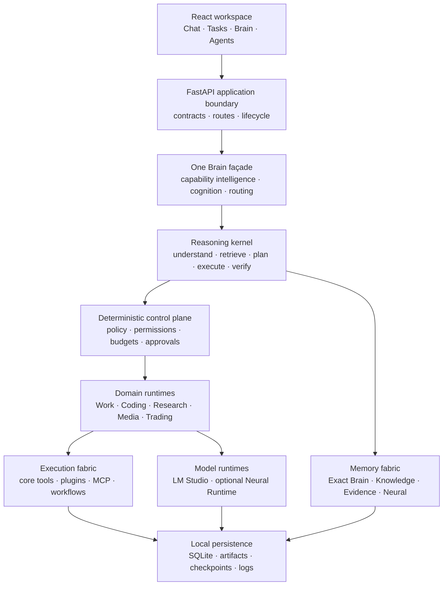
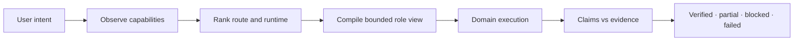
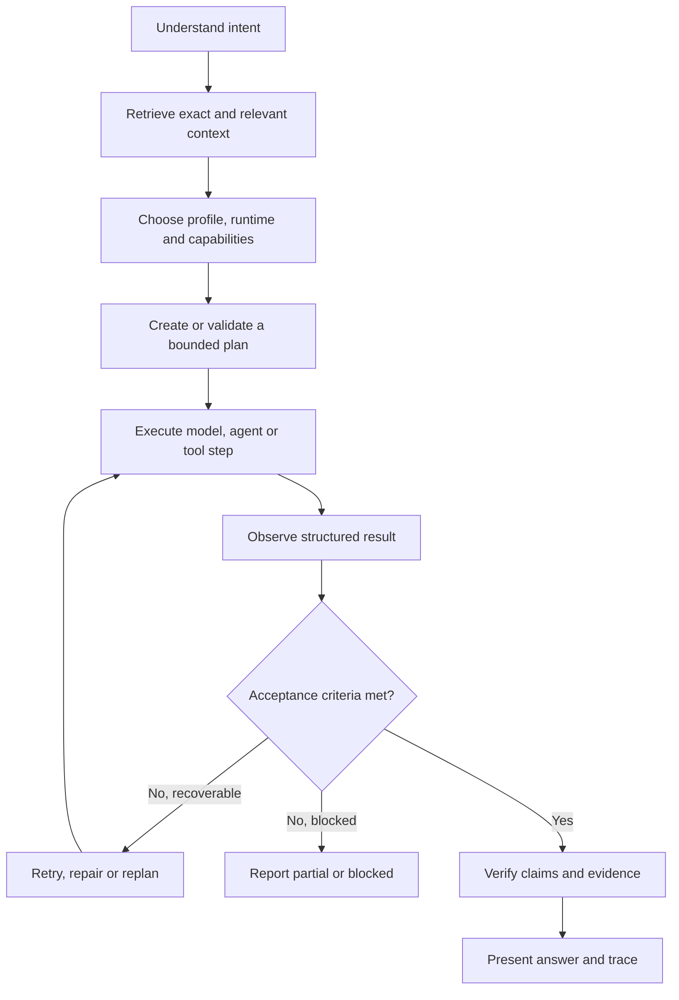
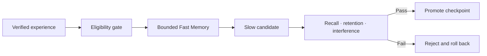

# HADES

### A local-first AI operating environment for reasoning, memory, agents, tools and verified execution

[](#project-status)
[](#requirements)
[](#technology-stack)
[](#technology-stack)
[](#data-and-persistence)
[](#technology-stack)

HADES is a Windows-first, offline-capable AI workspace built around local models. It combines persistent chat, adaptive reasoning, exact and associative memory, bounded agents, research, coding, plugins, MCP, workflows, evaluation and paper trading in one local application.

It is not a thin chat interface and it is not one large autonomous loop. HADES is designed as a layered system in which model intelligence, deterministic control, evidence, permissions and execution have separate responsibilities.

> **Core principle:** a model may propose, reason and route. Deterministic policy decides what is allowed. Evidence decides whether work may be called complete.

---

## Contents

- [Why HADES exists](#why-hades-exists)
- [System architecture](#system-architecture)
- [The architectural layers](#the-architectural-layers)
- [One Brain](#one-brain)
- [Reasoning and execution](#reasoning-and-execution)
- [Memory architecture](#memory-architecture)
- [Neural Memory](#neural-memory)
- [Agents, tools, plugins and MCP](#agents-tools-plugins-and-mcp)
- [Major product domains](#major-product-domains)
- [Security and trust boundaries](#security-and-trust-boundaries)
- [Data and persistence](#data-and-persistence)
- [Technology stack](#technology-stack)
- [Repository map](#repository-map)
- [Installation](#installation)
- [Development and verification](#development-and-verification)
- [Project status](#project-status)
- [Known boundaries](#known-boundaries)

---

## Why HADES exists

Local AI applications often stop at a model endpoint and a chat window. Agent demos may look capable while silently skipping failed tool calls, treating generated text as proof, ignoring restart recovery or presenting a started process as a healthy service.

HADES is built around the opposite assumptions:

- local operation is the default, not a degraded cloud mode;
- internet access is optional and controlled by policy;
- model output is not automatically trusted as evidence;
- exact facts and learned associations are different kinds of memory;
- a task is not complete until its acceptance criteria are checked;
- a tool is not healthy merely because a wrapper process started;
- blocked, partial, unmeasured and unverified are valid outcomes;
- long-running work must be cancellable, resumable and observable;
- model autonomy never overrides permissions, budgets or security gates.

The long-term goal is a capable personal AI system that can understand a request, retrieve the right context, select an appropriate runtime, perform bounded work, inspect the result and report truthfully what happened.

## System architecture



A normal request travels down the stack and its observations travel back up. The UI never owns reasoning or security logic. Model runtimes never own permissions. Domain runtimes own their execution truth, while the Brain provides shared contracts and routing without turning the application into a monolith.

## The architectural layers

### 1. Experience layer

The React 19 and TypeScript interface exposes HADES as a multi-surface workspace rather than a single chat box. The interface includes Chat, Tasks, Mission Control, Workflows, Agents, Coding, Research, Trading, Brain, Memory, Files, Plugins, MCP, Models, Media and Settings surfaces.

The frontend communicates through the typed HADES API client. It renders backend state and evidence, but it does not independently declare tools healthy, jobs complete or Neural ready.

### 2. Application and API layer

FastAPI is the local application boundary. It owns API contracts, request validation, route mounting, local-origin trust, lifecycle startup and shutdown, error correlation and service composition.

The backend is intentionally modular. `backend/main.py` composes services, while focused route modules and services keep Brain, models, work, Neural, MCP and Gen2 functionality separated. OpenAPI contracts can be exported and checked for drift.

### 3. One Brain coordination layer

`backend/hades_brain/` provides the canonical façade across HADES. One Brain is not one giant model or one replacement runtime. It is the shared coordination surface for:

- capability discovery and normalization;
- domain-aware routing;
- canonical agent, claim, evidence and verification contracts;
- tool binding and authority limits;
- cost and usage accounting;
- the Cognitive Runtime;
- local-node and substrate awareness.

Domain runtimes retain ownership of their proof and execution semantics. One Brain coordinates them through shared contracts.

### 4. Cognitive layer

The Cognitive Runtime adds bounded system-level cognition without becoming a second Brain. Its ten pillars are:

| Pillar | Responsibility |
|---|---|
| Self model | Describes current capability, state and limits |
| Perception | Selects observations under relevance and budget constraints |
| Epistemic control | Tracks uncertainty and decides when more evidence is needed |
| Ontology | Proposes and evaluates durable concepts |
| Immune system | Admits, rejects or quarantines unsafe knowledge |
| Mental models | Maintains bounded models of users and collaborating agents |
| Homeostasis | Reacts to overload, degraded health and resource pressure |
| Self-repair | Diagnoses faults and proposes controlled repairs |
| Scientific method | Creates hypotheses and runs controlled comparisons |
| Credit assignment | Attributes outcomes to the actions and capabilities involved |

Each pillar has an explicit mode. Adaptive influence defaults conservatively to `OFF` or `SHADOW`; cognitive recommendations do not bypass deterministic policy.

### 5. Reasoning kernel

`backend/reasoning/` implements the shared reasoning path. It separates task understanding, context construction, runtime selection, planning, tool protocol, model dispatch, steering, usage accounting and verification.

Reasoning profiles include Fast, Standard, High, Maximum and Adaptive. Profiles change budgets and depth; they do not remove security gates. A high reasoning setting is not permission to make unlimited model calls or invoke unnecessary critics.

### 6. Deterministic control plane

`backend/control/`, approval services, policy enforcement and execution boundaries form the non-negotiable control layer. This layer owns:

- capability definitions and resolution;
- permission states such as allow, ask and block;
- approval state and expiry;
- network and filesystem policy;
- resource and concurrency limits;
- immutable definitions and validation;
- cancellation and run control;
- effect registration and execution truth.

The LLM cannot rewrite these decisions through prompting.

### 7. Domain runtime layer

Specialized runtimes translate a general intention into domain-correct work. HADES currently contains dedicated paths for chat, Work tasks, coding, research, media, trading, plugins and MCP. This prevents one generic loop from pretending that all domains have the same evidence or completion rules.

### 8. Execution fabric

The execution layer contains built-in tools, plugin tools, MCP servers, workflows, background jobs and optional isolated runtimes. Calls use validated schemas and bounded arguments. Results preserve stdout, stderr, exit code, duration, timestamps, provenance and approval state where applicable.

### 9. Intelligence and model layer

LM Studio is the primary production model runtime through an OpenAI-compatible local API. Model discovery, routing, parameters, context budgets, retry behavior and failure classification are handled by backend services rather than embedded in the UI.

The optional Neural Runtime sits beside the standard ModelGateway. It does not replace LM Studio and cannot silently intercept normal chat.

### 10. Memory and evidence layer

HADES maintains several memory classes because one storage abstraction cannot safely represent every kind of knowledge. Exact facts, source documents, evidence snapshots, session associations, durable learned patterns and verified experiences remain distinguishable.

### 11. Persistence and observability layer

SQLite, artifact storage, checkpoint manifests, event streams, logs, metrics and the flight recorder make work durable and inspectable. The system stores not only final text but also task state, tool observations, evidence references, recovery state and verification outcomes.

### 12. Evaluation and release layer

HADES includes frontend contract tests, a large Python backend suite, adversarial cases, functional campaigns, reasoning and retrieval evaluations, security regressions, holdouts, release thresholds and host verification. Release tooling preserves honest states such as `UNMEASURED` and `UNVERIFIED_ON_HOST` instead of converting missing evidence into success.

## One Brain

One Brain unifies coordination while preserving boundaries.



Canonical contracts include:

- `CanonicalCapability`: what a capability is, its traits and side-effect class;
- `CanonicalAgent`: responsibility, inputs, outputs, tools, budgets and authority limits;
- `Claim`: a statement that may require proof;
- `Evidence`: provenance-bearing support for a claim;
- `VerificationOutcome`: deterministic and optional model-assisted verification results;
- `ContentRef`: stable references to artifacts, files, evidence, datasets, runs and summaries.

The Brain can recommend a route, but the selected runtime, policy layer and verifier remain responsible for execution and truth.

## Reasoning and execution

The conceptual HADES execution loop is:



Important properties:

- simple requests can stay simple and avoid an unnecessary agent plan;
- complex work can be decomposed into dependency-aware steps;
- tool rounds, model calls, observations and retries have explicit budgets;
- deadlocked or invalid plans are diagnosed instead of looping forever;
- steering and cancellation are first-class runtime signals;
- verification is risk- and task-aware, not an automatic tax on every response;
- completion states include `completed`, `partial`, `blocked`, `failed`, `cancelled` and `finished_unchecked`;
- when a tool budget expires, HADES reports incomplete execution rather than fabricating a final result.

The UI may show a structured trace of decisions, actions, evidence and status. Private chain-of-thought is neither required nor exposed.

## Memory architecture

HADES uses a tiered memory model:

| Memory class | Purpose | Authority |
|---|---|---|
| Conversation state | Recent dialogue, summaries and unresolved items | Context only |
| Exact Memory | User-approved facts and persistent records | Exact, inspectable |
| Knowledge Library | Ingested files, datasets and searchable chunks | Source-backed |
| Evidence Vault | Snapshots and provenance used to support claims | Evidence-grade |
| Brain graph | Relationships between knowledge, runs and concepts | Navigational/exact |
| Verified experience | Outcomes admitted after verification | Learning input |
| Fast Neural Memory | Bounded session-level associations | Non-authoritative |
| Slow Neural Memory | Evaluated durable patterns | Non-authoritative |
| Domain Neural Memory | Separate general, coding, research and trading banks | Non-authoritative |

Exact retrieval and Neural retrieval are never flattened into one indistinguishable context bag. Exact candidates retain source provenance. Neural candidates are labelled as untrusted neural associations.

## Neural Memory

Neural V1 is an optional associative-memory subsystem. Its purpose is to investigate learned recall and reusable patterns without modifying or replacing the main LLM.

### Design rules

- the base model remains frozen;
- PyTorch is not imported on the normal FastAPI startup path;
- the standard runtime remains the default;
- `neural_allow=false` and `neural_mode=off` are the conservative defaults;
- Neural cannot grant permissions or override policy;
- secrets and ineligible personal data are rejected from learning;
- raw model output cannot automatically become durable memory;
- incompatible checkpoints fail closed;
- a lower training loss is not sufficient for promotion;
- every candidate must pass recall, retention, interference and base-freeze gates;
- rejected candidates roll back to a known-good checkpoint.

### Runtime modes

| Mode | Behavior |
|---|---|
| `OFF` | Hard bypass; standard HADES behavior is unchanged |
| `SHADOW` | Runs experimental comparisons without changing the visible answer |
| `READ` | Allows approved Neural associations to contribute as labelled context |
| `LEARN` | Controlled offline continual-learning pipeline; unrestricted online learning is disabled |

### Fast and Slow memory

Fast Memory provides bounded, reversible session adaptation. Writes require verified experience, reliability, sufficient surprise and an available write budget.

Slow Memory stores durable patterns in versioned checkpoints. Promotion follows an evaluate-before-promote lifecycle:



### Domain isolation

General, coding, research and trading memories are independently versioned. Domain fusion is bounded and never changes tool permissions. Trading Neural memory remains opt-in.

### Current Neural boundary

Neural Runtime integration, lifecycle, dual retrieval, checkpoints, rollback, capacity control and UI contracts are implemented and tested. The current research runtime still uses toy-transformer quality and is not presented as production LM chat quality. LM Studio remains the primary model runtime.

## Agents, tools, plugins and MCP

### Agents

Agents are contract-bound roles, not unrestricted personalities. Each role can declare responsibility, required inputs, expected outputs, context, allowed tools, model preferences, budgets, acceptance criteria, recovery behavior and authority limits.

The scheduler supports queued work, bounded concurrency, timeouts, retry policies, cancellation, progress, persistent logs and recovery. Specialist routing is used only when it adds value; deterministic code remains preferred for deterministic work.

### Built-in tools

Core tools are registered through a catalog and shortlisted against the task. Tool requests are schema-validated, checked against policy and observed through structured results.

### Plugin Runtime V2

The plugin runtime supports package import, manifests, local dependency environments, lifecycle actions, health checks, manual tool execution and autonomous selection when allowed. Plugin actions use argument arrays rather than shell interpolation.

Permission semantics are explicit:

- `allow`: the capability may run within its configured boundaries;
- `ask`: an approval must be recorded before execution;
- `block`: execution is denied regardless of model preference.

A plugin process starting does not prove that the service is healthy. HADES validates declared HTTP, TCP or command health checks and stores real execution outcomes.

### MCP host and marketplace

The MCP subsystem contains catalog, lifecycle, transport, OAuth, secret handling, policy and validation components. MCP capabilities enter the same normalized capability system as native and plugin tools, so discovery does not bypass trust boundaries.

### Capability Intelligence

Capability Intelligence observes installed capabilities, normalizes their contracts, evaluates health and policy, ranks candidates and can propose marketplace handoffs when a required capability is absent. Selection is based on fitness and availability, not merely a matching name.

## Major product domains

| Domain | What it provides |
|---|---|
| Chat | Persistent conversations, per-chat models/prompts, adaptive reasoning, retrieval and streaming text |
| Work | Durable multi-step tasks, approvals, checkpoints, retries, evidence and completion gates |
| Mission Control | Gen2 missions, budgets, committees, policy profiles, flight recording and packaged outcomes |
| Workflows | Reusable graphs with adapters, dependencies and workflow-owned run status |
| Coding | Repository intelligence, planning, atomic edits, diagnostics, tests, review and delivery evidence |
| Research | Iterative source collection, coverage analysis, provenance, conflict handling and Evidence Vault output |
| Brain | Graph visualization, node detail, relationships and exact knowledge navigation |
| Neural | Runtime health, modes, domains, checkpoints, metrics and controlled learning state |
| Plugins | Import, setup, permissions, dependencies, tools, health, logs, repair, rollback and removal |
| MCP | Server discovery, connection lifecycle, authentication, catalog and secured tool access |
| Media | Ingestion, research, generation, rendering, QA, scheduling, publishing and analytics services |
| Voice | VAD, ASR, TTS providers, wake-word support, playback and speech-specific safety gates |
| Trading Lab | Point-in-time research, simulation, costs, risk, evaluation, learning cycles and paper-only execution |
| Training | Hardware-aware planning for GPU, CPU offload, QLoRA and streamed layer strategies |

## Security and trust boundaries

HADES treats model output, retrieved content, plugins and external servers as potentially unsafe inputs.

Key controls include:

- local API origin and trust validation;
- fail-closed URL and redirect checks;
- network policy enforcement;
- path and symlink boundaries;
- schema validation before tool execution;
- subprocess policy and argv-based invocation;
- approval state with timeout and secret redaction;
- protected headers, OAuth tokens and local secret storage for MCP;
- injection-resistant separation between data, instructions and permissions;
- effect ledgers and execution-truth checks;
- typed failure classification and correlation IDs;
- bounded concurrency, timeouts and cancellation;
- verification that connects claims to actual observations.

HADES provides application-level policy enforcement and optional isolation adapters. It does **not** claim that every plugin runs inside a universally hardened OS sandbox. Secured modes are designed to fail closed when the required host isolation is unavailable.

## Data and persistence

HADES is local-first and SQLite-backed. Core and platform data are separated where useful, while WAL and transaction boundaries support responsive local use.

Persisted state includes:

- chats, messages, summaries and pins;
- settings and model profiles;
- tasks, schedules, runs, leases and checkpoints;
- memory, knowledge chunks and evidence;
- agents, plans, approvals and tool observations;
- plugin and MCP configuration;
- artifacts, claims and verification outcomes;
- Neural manifests, checkpoints and domain registries;
- Trading Lab datasets, strategies, simulations and evaluations;
- telemetry, metrics, events and recovery state.

Backups and restore paths include safety checks so a restore cannot silently activate an unsafe or incomplete workspace.

## Technology stack

| Layer | Technology |
|---|---|
| Frontend | React 19, TypeScript 5.9, Vite 8, Tailwind CSS 4 |
| UI primitives | Base UI, shadcn, Radix UI, Lucide, Recharts |
| API | Python 3.11+, FastAPI, Pydantic |
| Persistence | SQLite with local artifact/checkpoint storage |
| Local models | LM Studio through an OpenAI-compatible API |
| Neural research | Optional PyTorch runtime, isolated from normal startup |
| Documents/research | Local extractors, chunking, retrieval and provenance services |
| Packaging | Windows batch launchers and optional PyInstaller executable |
| Quality | TypeScript, ESLint, frontend contracts, Python tests, eval harnesses and release gates |

## Repository map

```text
HADES/
├── app/                     Global application styling
├── components/
│   ├── hades/               Product surfaces and HADES UI components
│   └── ui/                  Shared UI primitives
├── lib/                     Frontend API, state and runtime helpers
├── backend/
│   ├── main.py              FastAPI composition root
│   ├── hades_brain/         One Brain contracts, routing and façade
│   ├── cognitive/           Ten cognitive pillars
│   ├── reasoning/           Understanding, planning, tools and verification
│   ├── control/             Deterministic control plane
│   ├── neural/              Fast/Slow/Domain Neural Memory and runtime
│   ├── gen2/                Mission Control, workflows and flight recorder
│   ├── capability_intel/    Capability discovery, ranking and policy
│   ├── mcp_host/            MCP lifecycle, clients, security and secrets
│   ├── trading_lab/         Point-in-time paper-trading research system
│   ├── media/               Media pipeline and platform services
│   ├── training/            Hardware-aware local training planner
│   ├── voice/               ASR, TTS, VAD and voice runtime
│   ├── runtime/             Execution gateway and effect ledger
│   ├── evals/               Functional, adversarial and quality evaluation
│   └── tests/               Backend regression and security suite
├── docs/                    Architecture, engineering, Neural and domain docs
├── tests/                   Frontend and cross-boundary contract tests
├── tools/                   Verification, packaging, baselines and reports
├── artifacts/               Checked-in audit and evaluation evidence
├── PREPARE_HADES.bat        First-time Windows setup
├── HADES.bat                One-click launcher
├── START_HADES.bat          Separate frontend/backend launcher
├── VERIFY_HADES.bat         Windows verification entrypoint
└── verify_hades.py          Full cross-stack release gate
```

## Installation

### Requirements

- Windows 10 or 11 for the first-class launcher experience;
- Node.js `>= 22.13`;
- Python `>= 3.11`;
- LM Studio with a loaded local model for model-backed features;
- sufficient disk space for dependencies, models, artifacts and optional Neural checkpoints.

Linux and macOS are usable for development, but some launchers and host probes are Windows-oriented.

### Windows quick start

1. Clone or download this repository.
2. Run `PREPARE_HADES.bat` once.
3. Open LM Studio, load a model and start its local server.
4. Confirm the default endpoint is available at `http://127.0.0.1:1234/v1`, or change it in HADES Settings.
5. Start HADES with `HADES.bat`.

`START_HADES.bat` launches frontend and backend in separate windows. `BUILD_HADES_EXE.bat` can create an optional PyInstaller executable; it is not required for normal operation.

### Developer setup

```bash
npm ci
python -m pip install -r backend/requirements.txt
npm run typecheck
npm run lint
npm run build
python verify_hades.py --quick
```

Start the frontend during development with:

```bash
npm run dev
```

Use the project launchers for the complete local stack, or start the FastAPI and Vite processes separately when debugging.

## Development and verification

### Main commands

```bash
# Frontend type and lint gates
npm run typecheck
npm run lint

# Production frontend build
npm run build

# Frontend release tests
npm run test:frontend:release

# Full frontend gate
npm test

# Cross-stack verification
python verify_hades.py --quick
python verify_hades.py

# OpenAPI contract drift
npm run contracts:check
```

### Evaluation paths

```bash
# Software and wiring evaluation without requiring a live model
cd backend
python -m evals.agent_eval --mode software

# Executable holdout using LM Studio when available
python -m evals.agent_eval --mode executable --split holdout --repeats 2
```

HADES distinguishes software wiring from live model quality. A passing deterministic suite does not prove that a particular local model will produce frontier-quality answers. Live-model results remain host- and model-dependent.

### Contribution rules

- preserve deterministic authority over model suggestions;
- do not convert unknown or unavailable states into success;
- add tests for policy, lifecycle and failure paths, not only happy paths;
- keep Exact Brain and Neural associations distinguishable;
- maintain API contracts and update generated contract evidence when required;
- avoid hidden shell execution and validate every external boundary;
- document host-dependent claims with the environment in which they were verified.

## Project status

Current repository version: **0.4.1**.

HADES is under active development. The repository contains working product paths alongside experimental and host-dependent capabilities. Major implemented areas include the local workspace, model gateway, persistent chat, Work runtime, One Brain, adaptive reasoning, tool orchestration, plugin runtime, MCP host, coding and research services, Mission Control, workflows, Neural V1 contracts, media/voice services, Trading Lab, evaluation suites and Windows release tooling.

Status language is intentionally precise:

| Label | Meaning |
|---|---|
| `PASS` | The stated check passed in the recorded environment |
| `PARTIAL` | Some required behavior exists, but the full claim is not proven |
| `BLOCKED` | An explicit dependency or policy prevented completion |
| `UNAVAILABLE` | The required runtime or service was not available |
| `UNMEASURED` | No valid measurement was produced |
| `UNVERIFIED_ON_HOST` | Code exists, but the host-specific behavior was not proven on that host |

## Known boundaries

- HADES does not contain or imitate a proprietary frontier model. Answer quality depends heavily on the selected local model.
- Neural V1 is an optional research subsystem; its current toy-transformer runtime is not a replacement for production LM chat.
- Unrestricted online Neural learning is disabled by design.
- Real-money trading is out of scope. Trading Lab is research and paper execution only.
- Application policy is not equivalent to a universally hardened OS sandbox.
- Windows is the primary supported product platform; other platforms are mainly developer targets.
- Internet research, remote MCP servers and online plugins require network policy to allow them.
- Some model, voice, media and training features require optional runtimes or hardware that are not installed by the core setup.
- A checklist being fully classified does not mean every capability is operational on every machine.

---

## Documentation

Detailed design and engineering records live in `docs/`, including:

- `docs/DECISIONS.md` — major engineering trade-offs;
- `docs/architecture/` — lifecycle, control-plane and boundary documents;
- `docs/neural/ARCHITECTURE.md` — Neural architectural decisions;
- `docs/neural/STATUS.md` — Neural V1 implementation status and limitations;
- `docs/engineering/` — evaluation, release and quality documentation;
- `docs/TRADING_LAB.md` — Trading Lab behavior and guarantees;
- `docs/TRAINING.md` — local training architecture;
- `docs/VOICE_STUDIO_TTS.md` — voice runtime integration.

---

<p align="center">
  <strong>HADES is built to do more than generate an answer:</strong><br/>
  understand the task, retrieve the right context, act within policy, verify the result and remember only what has earned trust.
</p>
