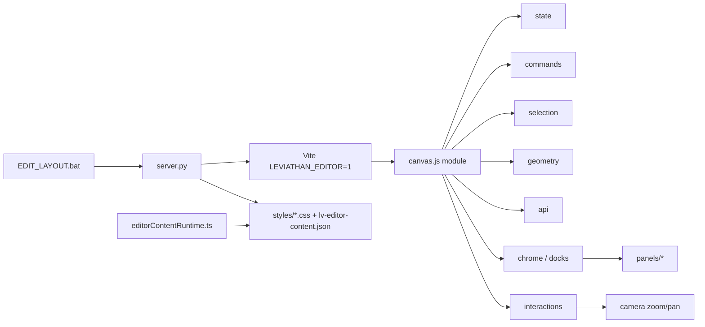

# Leviathan Visual Editor

Admin-studio om de echte Leviathan-layout te bewerken. Hoort niet bij de normale start.

```
EDIT_LAYOUT.bat
```

Opent http://127.0.0.1:5173 met de overlay. API: http://127.0.0.1:5199.
Zonder `LEVIATHAN_EDITOR=1` is er geen editor-UI. Opgeslagen wijzigingen blijven wel staan.

## Zonder editor

Gebruik de normale start (`run_leviathan.bat` / installer / build).
Dan is er geen editor-UI. `editorContentRuntime.ts` laadt alleen `lv-editor-content.json`.

- Editor alleen bij `LEVIATHAN_EDITOR=1` (via `EDIT_LAYOUT.bat`)
- Vite-plugin `apply: "serve"` — geen overlay in een production build
- API op `127.0.0.1:5199`; writes alleen binnen `Data/frontend`

## Architectuur



`canvas.js` is de enige inject (`type="module"`). De rest zijn plain ES-modules die `server.py` statisch serveert. Geen build-step voor de editor zelf. De Vite-plugin blijft `apply: "serve"`.

| Module | Rol |
| --- | --- |
| `js/state.js` | `getState` / `setState` / `subscribe` |
| `js/commands.js` | `execute({ do, undo, label })`, gestures, history max 100 |
| `js/selection.js` | primary + multi, shell-regels, deep-select |
| `js/geometry.js` | box, `resizeRect`, snap, guides, align, distribute, zoom-math |
| `js/layout.js` | `ensureFreeTransform` / `captureLayoutBox` / `commitBox`, align, nudge |
| `js/api.js` | fetch-wrappers |
| `js/chrome.js` | docks, tabs, float, presets (`localStorage`) |
| `js/panels/*` | eigen `render` + events |
| `js/interactions.js` | pointer machine (geen resize-math) |
| `js/camera.js` | zoom/pan, viewport-presets |
| `js/widgets.js` | insert, clipboard, group/flip, componenten |
| `js/registry.js` + `js/palette.js` | command palette |

Shell (`.lv-app .lv-body .lv-header .lv-sidebar .lv-footer .lv-right .lv-main`) wordt niet verwijderd of verplaatst. Maten lopen via CSS-variabelen.

## Free-transform model

De editor werkt op de **live Leviathan-DOM** (geen fake canvas-clone).

- **Shell** — alleen CSS-variabelen (header/sidebar/right/footer).
- **Widgets** (`data-lvb-id`) — free transform is default.
- **Bestaande pagina-nodes** (img, cards, tekst) — selecteren + slepen/resizen **promote** naar absolute box via `ensureFreeTransform`. Visueel geen sprong op pointerdown. Undo zet flow/positie terug.
- **Persistence** — zelfde pipeline: `content.applyProp` / `commitBox` → `entries` + `nodes[].styles`.
- **Camera** — `transform` op `#root`; nooit opgeslagen.
- **Resize** — schrijft `width`/`height` in layout-px. Nooit `transform: scale()` op het element (dat schaalt “alles”).
- **Rotated resize (MVP)** — axis-aligned op de geschreven box; AABB van `getBoundingClientRect` wordt niet opnieuw gepromote bij rotatie.

Eerste free move/resize:

1. `getBoundingClientRect` → layout-box t.o.v. containing block (`captureLayoutBox`)
2. `position:absolute; left/top/width/height` + `max-width:none` (images)
3. Startbox = die geschreven waarden (niet `parseFloat(style.left)||0`)

### Resize-handles (P0 fixes)

West/east bugs zijn opgelost in `geometry.resizeRect` + capture:

| Was | Nu |
| --- | --- |
| Missing `style.left` → `0` → west vloog naar links | Capture echte layout-box vóór write |
| West schreef ook `top` | Alleen de as van de handle |
| Clamp hield `left += dx` | Opposite-edge: `left = rightAnchor - width` |
| East zette altijd `height` | Width-only raakt height niet |
| Ratio default aan voor images | Ontgrendeld; Shift of inspector-lock |

## Wat wordt opgeslagen

| Actie | Bestand |
| --- | --- |
| Desktop-styles | `Data/frontend/src/styles/*.css` |
| Tekst / image-paden | bron via replace |
| Overrides, widgets, componenten, breakpoints | `Data/frontend/public/lv-editor-content.json` |
| Uploads | `Data/frontend/public/assets/uploads/` |

Content schema v2, backward compatible:

```json
{ "version": 2, "entries": {}, "nodes": [], "components": [] }
```

`entries[selector].breakpoints.tablet|mobile` zijn decls. Die gaan naar JSON, niet naar de desktop-CSS. De runtime past ze toe onder 1024px (tablet) en 640px (mobile).

Zoom en pan zijn een transform op `#root` en worden niet opgeslagen.

## Shortcuts

| Toets | Actie |
| --- | --- |
| `V` `H` `R` `M` | select, hand, roteren, meten |
| Spatie + slepen / middelste muis | pan |
| Ctrl/Cmd + scroll | zoom naar cursor (0.25×–3×) |
| `0` `1` `2` | 100%, breedte, selectie |
| Cmd/Ctrl+K | commandopalet |
| Cmd/Ctrl+S | opslaan |
| Cmd/Ctrl+Z / Shift+Z | undo / redo |
| Cmd/Ctrl+C V D | kopiëren, plakken, dupliceren |
| Cmd/Ctrl+G / Shift+G | groeperen / degroeperen |
| Delete | verwijderen of verbergen |
| Pijltjes / Shift | nudge 1px / 10px |
| Cmd/Ctrl+klik | deep-select |
| Shift+klik | toevoegen aan selectie |
| Dubbelklik | een niveau dieper, daarna tekst |
| Slepen op leeg vlak | marquee, Shift = toevoegen |
| **Shift tijdens resize** | aspect ratio lock (tijdelijk) |
| **Alt tijdens resize** | from center |
| Alt tijdens slepen | reparent (alleen widgets) |
| Alt+L C R T M B | uitlijnen |
| Alt+Shift+H / V | verdelen |
| `T` `B` `I` | tekst, box, image |
| Cmd/Ctrl+Alt+1 2 3 | desktop, tablet, mobile |
| Cmd/Ctrl+Alt+A | AI-paneel |
| Cmd/Ctrl+/ | help |

Alle commando's staan ook in het Help-paneel en in het palet. Palet zoekt fuzzy op commando's, recente acties en laagnamen.

## Studio

- Zoom, pan, measure, rotate, smart guides (goud = rand, magenta = midden), pixelgrid en 12 kolommen.
- Multi-select uitlijnen en verdelen.
- Inspector: spacing-box, formaat + ratio (default **vrij**), typografie, kleur + alpha + swatches, schaduwlagen, rand, flex/grid, positie (X/Y/W/H/rotate/z-index).
- Images: object-fit / object-position, flip H/V, replace via media.
- Group / ungroup widgets, copy/paste style, bring forward / send back.
- Token-knop schrijft `var(--lv-…)`. Gebonden waarden zijn gemarkeerd; Ontkoppel schrijft de berekende waarde terug.
- Lagen: boom, filter, oog, lock, drag-reorder, virtualisatie boven 200 rijen, broodkruimel boven de inspector.
- Panelen rechts met tabs, links lagen, onder code. Zweven via ↗. Presets Studio / Focus / Code.
- Componenten: `{ id, name, html, defaultStyles, variant }`, instance `data-lvb-component-id`. Master bijwerken vervangt HTML en houdt style.
- Responsive: Desktop / Tablet 834 / Mobile 390 als preview op `.lv-app`.
- AI: paneel “Toepassen” post naar `/api/editor-ai`. Zonder model antwoordt de server 501 en schrijft niets. Undo blijft gelden als er later wel een resultaat komt.

## Tests

```bash
cd editor && node --test test/core.test.mjs test/resize.test.mjs
```

`resize.test.mjs` dekt east/west/north clamp, corners, aspect, fromCenter, zoom-converted deltas.

## Manual QA (EDIT_LAYOUT.bat)

1. Insert image. Select. Drag **RIGHT** handle ~80px → width↑, height unchanged, left pinned, siblings do not scale.
2. Drag **LEFT** ~80px → right edge pinned, no fly-left, height unchanged.
3. Drag LEFT until min size, keep dragging → stops; does not walk left.
4. TOP / BOTTOM analog; width unchanged.
5. Corner SE free → both w/h; top-left pinned.
6. Corner + Shift → ratio locked.
7. Zoom 50% and 200%, repeat 1–3.
8. Pan off-zero, repeat 1–3.
9. Select a built-in page `` (not a widget): resize L/R — no jump on pointerdown, no fly-left.
10. Undo after resize restores previous box.
11. Save, reload editor: box persists.
12. Move + snap guides still work.
13. Shell sidebar/header resize still uses CSS vars, still clamped.
14. Rotate still works; after rotate, axis-aligned resize does not throw.

## Changelog — frontier

- Free-transform promote (`ensureFreeTransform`) on live DOM; no visual jump.
- Pure `resizeRect` with opposite-edge anchoring; P0 west-fly / east-scale fixed.
- Images: ratio unlocked by default; `max-width:none` while transforming; height freeze on promote.
- Inspector X/Y/W/H/rotate, object-fit, group/ungroup, flip, copy style.
- Boot blijft één script; logica in `editor/js/**` zonder bundler.
- Command-stack met undo/redo (max 100) en history pas op pointer-up.
- Echte camera: zoom naar cursor, pan, fit, chrome in schermpixels.
- Breakpoint-overrides in content-JSON; AI-contract stub 501.
