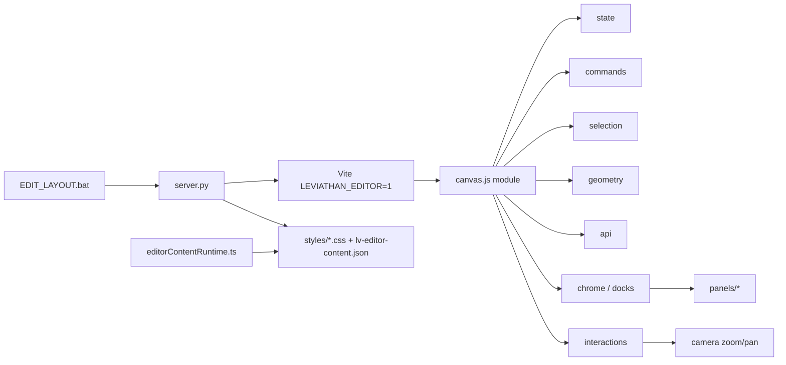

# Leviathan Visual Editor

Admin-studio om de echte Leviathan-layout te bewerken. Hoort niet bij de normale start.

```
EDIT_LAYOUT.bat
```

Opent http://127.0.0.1:5173 met de overlay. API: http://127.0.0.1:5199.
Zonder `LEVIATHAN_EDITOR=1` is er geen editor-UI. Opgeslagen wijzigingen blijven wel staan.

## Architectuur



`canvas.js` is de enige inject (`type="module"`). De rest zijn plain ES-modules die `server.py` statisch serveert. Geen build-step voor de editor zelf. De Vite-plugin blijft `apply: "serve"`.

| Module | Rol |
| --- | --- |
| `js/state.js` | `getState` / `setState` / `subscribe` |
| `js/commands.js` | `execute({ do, undo, label })`, gestures, history max 100 |
| `js/selection.js` | primary + multi, shell-regels, deep-select |
| `js/geometry.js` | box, snap, guides, align, distribute, zoom-math |
| `js/api.js` | fetch-wrappers |
| `js/chrome.js` | docks, tabs, float, presets (`localStorage`) |
| `js/panels/*` | eigen `render` + events |
| `js/interactions.js` | pointer machine |
| `js/camera.js` | zoom/pan, viewport-presets |
| `js/layout.js` | align, distribute, nudge |
| `js/widgets.js` | insert, clipboard, componenten |
| `js/registry.js` + `js/palette.js` | command palette |

Shell (`.lv-app .lv-body .lv-header .lv-sidebar .lv-footer .lv-right .lv-main`) wordt niet verwijderd of verplaatst. Maten lopen via CSS-variabelen.

## Wat wordt opgeslagen

| Actie | Bestand |
| --- | --- |
| Desktop-styles | `Data/frontend/src/styles/*.css` |
| Tekst / image-paden | bron via replace |
| Overrides, widgets, componenten, breakpoints | `Data/frontend/public/lv-editor-content.json` |
| Uploads | `Data/frontend/public/assets/uploads/` |

Content schema v2, backward compatible:

```json
{ "version": 2, "entries": {}, "nodes": [], "components": [] }
```

`entries[selector].breakpoints.tablet|mobile` zijn decls. Die gaan naar JSON, niet naar de desktop-CSS. De runtime past ze toe onder 1024px (tablet) en 640px (mobile).

Zoom en pan zijn een transform op `#root` en worden niet opgeslagen.

## Shortcuts

| Toets | Actie |
| --- | --- |
| `V` `H` `R` `M` | select, hand, roteren, meten |
| Spatie + slepen / middelste muis | pan |
| Ctrl/Cmd + scroll | zoom naar cursor (0.25×–3×) |
| `0` `1` `2` | 100%, breedte, selectie |
| Cmd/Ctrl+K | commandopalet |
| Cmd/Ctrl+S | opslaan |
| Cmd/Ctrl+Z / Shift+Z | undo / redo |
| Cmd/Ctrl+C V D | kopiëren, plakken, dupliceren |
| Delete | verwijderen of verbergen |
| Pijltjes / Shift | nudge 1px / 10px |
| Cmd/Ctrl+klik | deep-select |
| Shift+klik | toevoegen aan selectie |
| Dubbelklik | een niveau dieper, daarna tekst |
| Slepen op leeg vlak | marquee, Shift = toevoegen |
| Alt tijdens slepen | reparent (alleen widgets) |
| Alt+L C R T M B | uitlijnen |
| Alt+Shift+H / V | verdelen |
| `T` `B` `I` | tekst, box, image |
| Cmd/Ctrl+Alt+1 2 3 | desktop, tablet, mobile |
| Cmd/Ctrl+Alt+A | AI-paneel |
| Cmd/Ctrl+/ | help |

Alle commando's staan ook in het Help-paneel en in het palet. Palet zoekt fuzzy op commando's, recente acties en laagnamen.

## Studio

- Zoom, pan, measure, rotate, smart guides (goud = rand, magenta = midden), pixelgrid en 12 kolommen.
- Multi-select uitlijnen en verdelen.
- Inspector: spacing-box, formaat + ratio, typografie, kleur + alpha + swatches, schaduwlagen, rand, flex/grid, positie. Geavanceerd CSS blijft een vouw.
- Token-knop schrijft `var(--lv-…)`. Gebonden waarden zijn gemarkeerd; Ontkoppel schrijft de berekende waarde terug.
- Lagen: boom, filter, oog, lock, drag-reorder, virtualisatie boven 200 rijen, broodkruimel boven de inspector.
- Panelen rechts met tabs, links lagen, onder code. Zweven via ↗. Presets Studio / Focus / Code.
- Componenten: `{ id, name, html, defaultStyles, variant }`, instance `data-lvb-component-id`. Master bijwerken vervangt HTML en houdt style.
- Responsive: Desktop / Tablet 834 / Mobile 390 als preview op `.lv-app`.
- AI: paneel “Toepassen” post naar `/api/editor-ai`. Zonder model antwoordt de server 501 en schrijft niets. Undo blijft gelden als er later wel een resultaat komt.

## Changelog — frontier

De Dreamweaver-overlay is een modulaire studio geworden:

- Boot blijft één script; logica zit in `editor/js/**` zonder bundler.
- Command-stack met undo/redo (max 100) en history pas op pointer-up.
- Echte camera: zoom naar cursor, pan, fit, chrome in schermpixels.
- Modes, deep-select, drill-in, marquee, align/distribute, betrouwbare guides.
- Visuele inspector, lagenboom, commandopalet, tokens, lichte componenten.
- Breakpoint-overrides in content-JSON.
- AI-contract en stub-endpoint, bevestiging verplicht.
- Runtime zonder editor past entries, nodes én breakpoint-decls toe.
